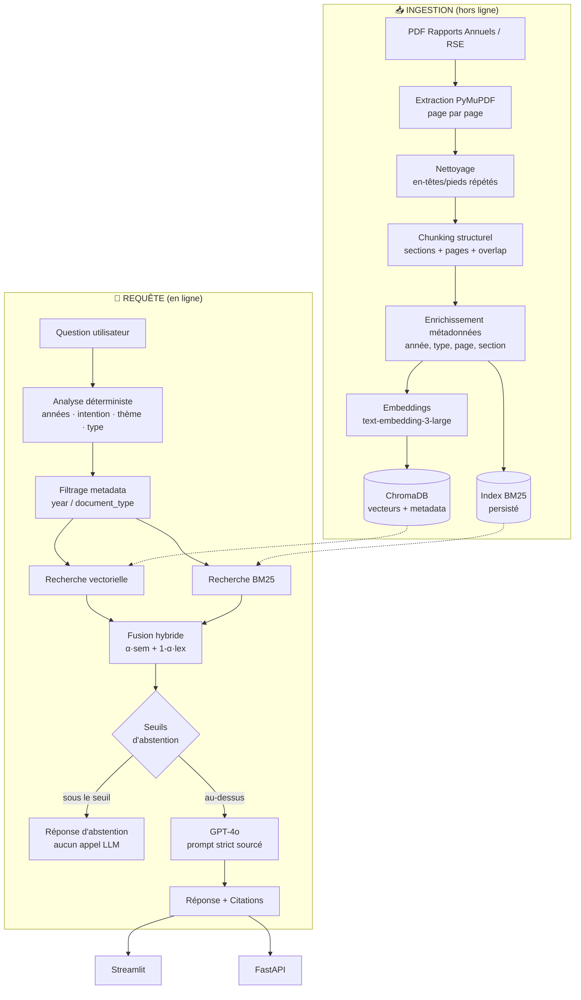

# ⚓ Tanger Med Knowledge Assistant

> Système **RAG multi-années** pour l'exploration et l'analyse intelligente des
> Rapports Annuels et Rapports RSE du Groupe Tanger Med.
> Réponses générées par GPT-4o, **strictement sourcées**, avec citations
> page par page et **abstention** lorsque l'information n'existe pas dans le corpus.

---

## 1. Présentation

Ce projet est un prototype professionnel de **Retrieval-Augmented Generation**
appliqué au corpus documentaire public de Tanger Med. Il permet d'interroger en
langage naturel plusieurs années de rapports (annuels et RSE), de comparer des
indicateurs entre exercices, et d'obtenir systématiquement la trace exacte
(document, année, page) de chaque information utilisée.

L'accent est mis sur les points qui font la différence entre un « chatbot sur
PDF » et un vrai système RAG d'entreprise :

| Enjeu | Traitement dans ce projet |
|---|---|
| Traçabilité | Citations document + année + **page**, extrait source consultable |
| Hallucinations | Double garde-fou d'abstention + prompt strict + test de fidélité numérique |
| Questions multi-années | Retrieval **équilibré par année**, jamais un top-k global |
| Chiffres / acronymes | Recherche **hybride** (vectorielle + BM25), pas seulement sémantique |
| Corpus réel désordonné | Nettoyage des en-têtes répétés, déduplication, correction de documents mal classés |
| Évaluation | Harnais de mesure dédié (retrieval, abstention, citations, fidélité) |

---

## 2. Problématique

Les rapports Tanger Med représentent plusieurs centaines de pages par année,
réparties sur de multiples documents (annuel + RSE) et exercices. La consultation
manuelle rend difficile :

- la recherche d'une information précise dans des documents volumineux ;
- la comparaison d'un indicateur entre plusieurs exercices ;
- l'identification de l'évolution d'une trajectoire (trafic, décarbonation, RH) ;
- la **traçabilité** de la réponse jusqu'à sa page d'origine ;
- la synthèse d'informations dispersées dans plusieurs documents.

## 3. Objectifs

1. Répondre en langage naturel à partir d'un corpus multi-années.
2. Citer précisément les sources (document, année, page, section).
3. Gérer le raisonnement temporel (année unique, comparaison, évolution).
4. **Ne jamais inventer** : refuser explicitement quand l'information est absente.
5. Exposer le tout via une API propre et une interface de démonstration.
6. Mesurer objectivement la qualité du système.

---

## 4. Architecture



### Flux multi-années

Pour une question de comparaison ou d'évolution, le système **n'exécute pas** une
recherche globale : il lance une recherche filtrée **par année**, garantissant que
chaque exercice demandé dispose de sa part du contexte.

```
"Comparez le CA entre 2024 et 2025"
   → recherche(years=[2024]) → k chunks de 2024
   → recherche(years=[2025]) → k chunks de 2025
   → contexte équilibré → GPT-4o
```

---

## 5. Technologies

| Couche | Choix | Justification |
|---|---|---|
| LLM | **OpenRouter** → `openai/gpt-4o` | API compatible OpenAI, modèle imposé par le cahier des charges |
| Embeddings | `openai/text-embedding-3-large` (3072d) | Qualité multilingue (corpus français) |
| Extraction PDF | **PyMuPDF** | Rapide, fiable, conserve le numéro de page |
| Vector DB | **ChromaDB** (persistant) | Embarqué, sans serveur, index HNSW, filtrage metadata natif |
| Lexical | **rank-bm25** | Complément indispensable pour chiffres/acronymes/années |
| API | **FastAPI** + Uvicorn | Typage Pydantic, OpenAPI auto |
| UI | **Streamlit** | Démonstration rapide et lisible |
| Config | **pydantic-settings** | Configuration typée, 100 % pilotée par `.env` |
| Fiabilité | **tenacity** | Retries bornés avec backoff exponentiel |
| Tests | **pytest** | 108 tests, 100 % hors ligne |

---

## 6. Structure du projet

```
tanger-med-rag/
├── app/
│   ├── api/              # FastAPI : routes, schémas, application
│   ├── config/           # Configuration centralisée (pydantic-settings)
│   ├── ingestion/        # loader · cleaner · chunker · pipeline · CLI
│   ├── retrieval/        # vector_store · bm25 · hybrid
│   ├── rag/              # query_analyzer · prompts · generator · pipeline
│   ├── models/           # Schémas Pydantic partagés
│   └── utils/            # logging · text · openrouter_client
├── data/
│   ├── annual_reports/   # Rapports annuels (PDF)
│   └── rse_reports/      # Rapports RSE (PDF)
├── data_sources/         # Transcription des extraits 2025 (obsolète, voir §9)
├── evaluation/           # questions.json + evaluate.py
├── scripts/              # check_openrouter.py · build_sample_data.py
├── tests/                # 108 tests (ingestion, retrieval, rag, api)
├── vectorstore/          # ChromaDB + index BM25 (généré)
├── streamlit_app.py
├── requirements.txt
└── .env.example
```

---

## 7. Installation

```bash
python -m venv .venv
# Windows
.venv\Scripts\activate
# Linux / macOS
source .venv/bin/activate

pip install -r requirements.txt
```

## 8. Configuration OpenRouter

Copiez `.env.example` vers `.env` puis renseignez votre clé :

```env
OPENROUTER_API_KEY=sk-or-v1-...
OPENROUTER_MODEL=openai/gpt-4o
OPENROUTER_EMBEDDING_MODEL=openai/text-embedding-3-large
OPENROUTER_EMBEDDING_DIM=3072
```

> 🔐 La clé n'est **jamais** en dur dans le code : elle est lue exclusivement
> depuis l'environnement. `.env` est ignoré par git.

**Vérifiez la connectivité réelle avant toute ingestion :**

```bash
python scripts/check_openrouter.py
```

Ce script effectue **deux vrais appels API** (un chat, un embedding) et indique
précisément ce qui fonctionne.

> ⚠️ **Note sur les embeddings** : OpenRouter route principalement des modèles de
> *chat*. Si l'endpoint `/embeddings` renvoie une erreur 400/404, basculez les
> embeddings vers un fournisseur compatible OpenAI **sans modifier une ligne de
> code**, via deux variables :
> ```env
> EMBEDDINGS_BASE_URL=https://api.openai.com/v1
> EMBEDDINGS_API_KEY=sk-...
> ```
> Le script de diagnostic vous le dira explicitement.

## 9. Ajout des rapports

Déposez les PDF officiels ([tangermed.ma/fr/documentation](https://www.tangermed.ma/fr/documentation/),
thématique « Rapports Annuels et RSE ») dans :

```
data/annual_reports/   →  rapport_annuel_2024.pdf, ...
data/rse_reports/      →  rapport_rse_2024.pdf, ...
```

**Seule contrainte** : le nom de fichier doit contenir l'année sur 4 chiffres
(elle sert de métadonnée de filtrage). Le système détecte et corrige
automatiquement un document mal classé (un rapport RSE déposé dans
`annual_reports/` est reclassé d'après son nom) et ignore les doublons
strictement identiques.

Le corpus actuellement indexé — les six PDF officiels complets, **2 526 chunks** :

| Document | Pages | Chunks |
|---|---|---|
| Rapport Annuel 2023 | 119 | 313 |
| Rapport Annuel 2024 | 130 | 555 |
| Rapport Annuel 2025 | 109 | 490 |
| Rapport RSE 2023 | 101 | 324 |
| Rapport RSE 2024 | 99 | 391 |
| Rapport RSE 2025 | 116 | 453 |

> ⚠️ **Remplacer un PDF déjà indexé.** Gardez le même nom de fichier : le
> manifeste détecte le changement de hash, les anciens chunks sont supprimés et
> seul ce document est réindexé. Si vous changez le nom, les chunks de l'ancien
> fichier restent orphelins dans ChromaDB — purgez-les avec
> `VectorStore.delete_by_source_file("<ancien-nom>.pdf")` et retirez son entrée du
> manifeste, ou reconstruisez tout avec `--force`.

> `scripts/build_sample_data.py` et `data_sources/` ne servaient qu'à matérialiser
> les extraits 2025 fournis avec le brief, avant que les PDF officiels ne soient
> disponibles. Ne relancez pas ce script : il réintroduirait des rapports 2025
> partiels **à côté** des complets, avec des noms de fichiers différents — donc un
> corpus 2025 dédoublé.

## 10. Ingestion

```bash
python -m app.ingestion           # incrémental (ignore les fichiers inchangés)
python -m app.ingestion --force   # reconstruction complète de l'index
```

L'ingestion maintient un manifeste (`vectorstore/ingestion_manifest.json`) basé
sur le hash SHA-256 de chaque PDF : relancer la commande ne re-facture pas
d'embeddings pour les documents inchangés.

## 11. Lancement du backend

```bash
uvicorn app.api.app:app --reload --port 8000
```

| Endpoint | Description |
|---|---|
| `POST /api/query` | Question → réponse + citations |
| `GET /api/health` | État de l'index et de la configuration |
| `GET /api/documents` | Inventaire du corpus indexé |
| `GET /docs` | Documentation OpenAPI interactive |

```bash
curl -X POST http://localhost:8000/api/query \
  -H "Content-Type: application/json" \
  -d '{"question":"Quel a été le tonnage global en 2025 ?","years":[2025]}'
```

## 12. Lancement de l'interface

```bash
streamlit run streamlit_app.py
```

L'UI permet de filtrer par année et par type de rapport, d'afficher les extraits
sources, et d'activer un panneau **Debug / Retrieval** (scores, temps par étape,
analyse de la question).

> L'UI et l'API consomment **la même classe de service** `RAGPipeline` : aucune
> logique métier n'est dupliquée, les deux front-ends ne peuvent pas diverger.

---

## 13. Exemples de questions

**Factuelles**
- Quel a été le tonnage global de marchandises traité en 2025 ?
- Quel est le chiffre d'affaires consolidé du Groupe et sa progression ?
- Quelle est la part de femmes managers au sein du Groupe ?

**Thématiques**
- Quelles sont les principales actions de décarbonation menées par Tanger Med ?
- Comment est organisée la gouvernance RSE du Groupe ?
- Quels dispositifs de sécurité des systèmes d'information sont en place ?

**Temporelles / comparatives**
- Comparez le chiffre d'affaires entre 2024 et 2025.
- Comment le trafic du complexe portuaire a-t-il évolué entre 2023 et 2025 ?
- Comparez la part de femmes managers entre 2023 et 2025.

**Hors corpus (doivent déclencher l'abstention)**
- Quel était le chiffre d'affaires de Tanger Med en 2030 ?
- Quel est le cours de l'action Apple aujourd'hui ?

---

## 14. Architecture RAG en détail

### Chunking structurel
Le découpage n'est pas un simple `split` de N caractères :
- détection heuristique des titres (casse, longueur, ponctuation, densité de chiffres) ;
- suivi de la **section courante** reportée dans les métadonnées de chaque chunk ;
- suivi de la **plage de pages** (`page_start` / `page_end`) — un chunk peut
  chevaucher deux pages, la citation reste exacte (`p. 90-91`) ;
- overlap configurable pour ne pas perdre le contexte aux frontières ;
- repli phrase-à-phrase pour les paragraphes plus longs qu'un chunk.

### Recherche hybride
```
score = RETRIEVAL_ALPHA × score_sémantique + (1 − RETRIEVAL_ALPHA) × score_lexical
```
Les deux composantes sont normalisées dans `[0,1]` :
- **sémantique** : similarité cosinus brute (non rééchelonnée, pour rester interprétable) ;
- **lexical** : transformation saturante `raw / (raw + k)`.

> **Décision de conception importante.** Une normalisation min-max ou max
> attribue toujours `1.0` au meilleur résultat, *même pour une question sans
> rapport avec le corpus* — ce qui rend tout seuil d'abstention inopérant. La
> transformation saturante conserve l'information de magnitude absolue.

### Pas d'étape de reranking

Le classement retenu est celui de la fusion hybride. Il n'y a **pas** de
reranker, et c'est un choix assumé plutôt qu'un oubli.

Un reranker utile est un cross-encoder : il lit la paire (question, passage)
ensemble et la note, là où la recherche vectorielle compare deux vecteurs
calculés séparément. Il est nettement plus précis, mais il impose une
dépendance lourde (PyTorch) et un téléchargement de modèle, et il doit tourner
une fois par candidat à chaque question.

Surtout, il ne rapporte vraiment que lorsqu'on récupère beaucoup de candidats
pour n'en garder que quelques-uns. Ici `TOP_K=8` par voie, soit au plus
16 candidats après déduplication, pour `FINAL_CONTEXT_K=5` : la marge de
réordonnancement est trop faible pour justifier ce coût.

Une version précédente exposait une interface `Reranker` et une implémentation
qui se contentait de trier sur le score déjà calculé — donc sans aucun effet sur
l'ordre ni sur la sélection. Elle a été supprimée : une abstraction qui simule
une étape inexistante est plus trompeuse qu'utile. Pour en ajouter un vrai :
monter `TOP_K` à 25-30, noter les candidats dans `HybridRetriever.search()`
après `_fuse()`, et mesurer avec `evaluation/evaluate.py` si `retrieval_hit`
progresse réellement.

---

## 15. Stratégie anti-hallucination

Trois lignes de défense **indépendantes** :

**1. Filtrage structurel** — une question sur 2030 alors que le corpus s'arrête
en 2025 ne retourne aucun chunk : l'abstention est mécanique.

**2. Double seuil d'abstention** (avant tout appel LLM, donc sans coût) :

| Garde-fou | Variable | Rôle |
|---|---|---|
| Score fusionné | `RELEVANCE_THRESHOLD` | Rien de suffisamment pertinent |
| Score sémantique | `MIN_SEMANTIC_SCORE` | Question **hors sujet** |

Le second garde-fou est essentiel et découle d'une mesure réelle sur ce corpus :
la question *« Quel est le cours de l'action Apple ? »* obtient un score BM25 de
**13,3** — supérieur à une question environnementale légitime (**9,1**) — parce
que « action » et « cours » saturent le vocabulaire des rapports. **Seul le score
sémantique distingue le hors-sujet.**

**3. Prompt système strict** — interdiction de répondre hors contexte, de mélanger
les années, de recalculer un chiffre, obligation de citer et de signaler
explicitement toute information manquante.

## 16. Citations

Chaque réponse renvoie, pour chaque source : document, type, **année**, **page(s)**,
section, score de pertinence, extrait consultable et URL officielle.

```json
{
  "document": "Rapport Annuel 2025",
  "year": 2025,
  "page": "p. 9",
  "section": "NOS CHIFFRES CLEFS",
  "relevance_score": 0.83,
  "excerpt": "209 MT de marchandises traitées...",
  "source_url": "https://www.tangermed.ma/fr/documentation/"
}
```

## 17. Évaluation

```bash
python evaluation/evaluate.py
python evaluation/evaluate.py --output evaluation/results.json
```

19 questions réparties en 6 catégories (factuelles, thématiques, temporelles,
comparaisons, évolutions, hors corpus). Métriques :

| Métrique | Mesure |
|---|---|
| `retrieval_hit` | Un passage récupéré contient l'information attendue |
| `year_coverage` | **Chaque** année demandée est représentée dans les citations |
| `abstention_correct` | Le système s'abstient exactement quand il le doit |
| `citation_valid` | Citations complètes et années réellement présentes au corpus |
| `faithfulness_numeric` | **Tout nombre écrit dans la réponse existe dans le contexte** |
| `answer_keywords` | Les éléments attendus figurent dans la réponse |

`faithfulness_numeric` est un contrôle déterministe et peu coûteux,
particulièrement adapté à un corpus dense en indicateurs : il détecte les KPI
inventés, la forme d'hallucination la plus dommageable ici.

**Dernier relevé** avec `openai/gpt-4o` + `openai/text-embedding-3-large`, sur un
corpus de 1 647 chunks (les rapports 2025 n'étaient alors indexés que
partiellement) :

```
Abstention correcte  : 19/19 (100%)
Couverture des années: 11/11 (100%)
Citations valides    : 19/19 (100%)
Retrieval hit        : 15/15 (100%)
Mots-clés attendus   : 10/10 (100%)
Fidélité numérique   : 11/15  (73%)
```

> Deux évolutions rendent ce relevé obsolète, dans le bon sens. Les écarts de
> fidélité numérique venaient de nombres voisins recollés par l'extraction PDF
> (« 2025 63% » lu comme `202563`), corrigés depuis dans la détection de nombres
> de l'évaluateur. Et le corpus compte désormais **2 526 chunks** : les rapports
> 2025 officiels complets ont remplacé leurs versions partielles. Relancez la
> commande pour un relevé à jour.

**Intégration RAGAS** : l'export `--output` produit pour chaque question
`question` / `answer` / `contexts` / `sources`, qui correspond exactement au
schéma d'entrée attendu par RAGAS pour des métriques jugées par LLM.

## 18. Tests

```bash
pytest tests/ -q          # 108 tests, ~5s, aucun appel réseau
```

| Fichier | Couverture |
|---|---|
| `test_ingestion.py` | Année, type de document mal classé, boilerplate, chunking, pages, métadonnées |
| `test_retrieval.py` | BM25 (filtres, normalisation absolue), ChromaDB réel, fusion hybride |
| `test_rag.py` | Analyse de requête, prompts, abstention (2 garde-fous), multi-années, citations |
| `test_api.py` | Contrats HTTP, validation, mapping d'erreurs (502/500 sans fuite de détails) |

---

## 19. Limites connues

- **Tableaux** : le texte des tableaux est extrait en flux, sans structure
  ligne/colonne. Les questions nécessitant un **calcul exact** sur un tableau
  doivent être traitées par une extraction structurée (voir §20).
- **PDF scannés** : aucun OCR — les documents doivent contenir une couche texte.
- **Reranking** : aucun. Le classement est celui de la fusion hybride (voir §14).
- **Seuils** : `RELEVANCE_THRESHOLD` et `MIN_SEMANTIC_SCORE` sont calibrés pour ce
  corpus et ce modèle d'embeddings ; ils doivent être recalibrés via
  `evaluation/evaluate.py` en cas de changement.
- **Couverture** : le corpus se limite aux Rapports Annuels et RSE 2023 à 2025.
  Toute question portant sur une autre année ou un autre document donne — et doit
  donner — une abstention.

## 20. Améliorations futures

1. **Extraction structurée des tableaux** → DataFrame/SQL pour les calculs exacts
   (Text-to-SQL sur les indicateurs), l'architecture est prête à l'accueillir.
2. **Reranking par cross-encoder**, après avoir élargi `TOP_K`, avec mesure
   avant/après du `retrieval_hit` (voir §14).
3. **Cache sémantique** des questions fréquentes (réduction coût/latence).
4. **Réponses en streaming** dans l'UI.
5. **Évaluation continue** en CI sur chaque modification de prompt ou de seuil.
6. **Support multilingue** (requêtes en anglais / arabe sur corpus français).

---

## Récapitulatif des commandes

```bash
pip install -r requirements.txt        # installation
python scripts/check_openrouter.py     # vérifier la clé et les modèles
python -m app.ingestion --force        # indexer les rapports
streamlit run streamlit_app.py         # interface (http://localhost:8501)
uvicorn app.api.app:app --port 8000    # API (http://localhost:8000/docs)
pytest tests/ -q                       # tests
python evaluation/evaluate.py          # évaluation
```
